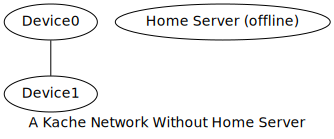
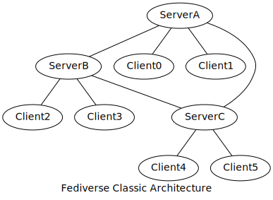

# Kache

## Goals and Overview

Kache is a decentralised application framework to provide a user- and developer-friendly experience.

It aims to provide these basic concepts:

- Distributed file system with eventual consistency
- EventPub (just like ActivityPub but for machine-friendly events)
- Consistency algorithm
- Automagical best-effort transfering relays and NAT travsal

## Table of Contents

- Goals and Overview
- Kache Network
  - Basic Concepts
  - Working over I2P
- Vaults
  - EventPub
  - File System
- Kache Court
  - Working Process
  - Issues
- Relays
- Word Definitions
- Further Readings
- Authors
- License

## Kache Network

Kache is about connecting different processes across devices. A kache network includes all inter-connecting processes using kache.

````
+---------------------+
|                     |
+-------+ Application +
| Kache |             |
+-------+-------------+
|       I2P           |
+---------------------+
````

Kache and third-party applications both works on I2P, which provides access from any network with consistent addresses even in a mobile environment. Application using kache by OS-agent or the library to access kache's functions. I2P is integrated into the library for complete control.

### Basic Concepts

Kache networks have one home server and at least one device.


A home server is required for network join but is unrequired for the daily functions of kache. A Home server is a "device" but in a special role, served as a backup and a gatekeeper in kache.

Except stated otherwise, any kache functionality must be available whether the home server is online or offline. 



Such architecture works like "fediverse" but not exactly is, could be called "weak-fediverse", which can continue its functionality during the server on the network is down.



### Working over I2P

Kache network is being built over the I2P network.

A Home server may be connected through a public network rather than the I2P network for limited functions. These functions are network join, signing in, information exchanging between two home servers and other implicitly stated.

## Vaults

Vault is the key concept in kache's application interface. A vault is unique with a 64-bit identity of a file system or events. The identity is a KSSID (Kache Simple & Short IDentity).

### EventPub

EventPub is a reliable message delivery middleware.

#### Concepts

For each vault, each device has an "inbox". The inbox is identified by vault's and device's identity, which is a 128-bit identity combined. An inbox can send or receive messages to or from other inboxes.

Besides identity, a message has a topic. The topic can be used to filter specific messages.

#### Transferring layout

EventPub does zero restrictions on a message's body. The below layout is for messages in transport.

````
| Sender (128 bits) | Destination (128 bits) | Topic (8 bits + N bytes) | BodyLenType (2 bit) | BodyLen (8, 16, 32 or 64 bits) | Body (N bytes) |
````

EventPub must support broadcasting. To broadcast a message, set the latter 64 bits in destination, the identity of the device, to zero.
