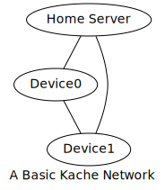

# Kache

## Goals and Overview

Kache is a decentralised application framework to provide user-friendly and developer-friendly experience.

It aims to provide these basic concepts:

- Distributed file system with eventual consistency
- EventPub (just like ActivityPub but for machine-friendly events)
- Consistency algorithm
- Automagical best-effort transfering relays and NAT travsal

To simplify network programming, kache integrates I2P to provide network functionality.

## Table of Contents

- Goals and Overview
- Kache Network
  - Basic Concepts
  - Working Only on I2P
- Vaults
  - File System
  - EventPub
- Kache Court
  - Working Process
  - Issues
- Relays
- Word Defintions
- Further Readings
- Authors
- License

## Kache Network

Kache is about connecting different processes across devices. A kache network includes all inter-connecting processes using kache.

````
+---------------------+
|                     |
+-------+ Application +
| Kache |             |
+-------+-------------+
|       I2P           |
+---------------------+
````

Kache and third-party applications both works on I2P, which provides network accessing from consistent addresses even in mobile environment. Application using kache by OS-agent or kache library to access kache functions. I2P is integrated to kache library for full control.

### Basic Concepts

Any kache network have one home server and at least one device.


