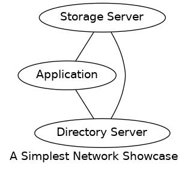
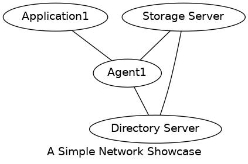
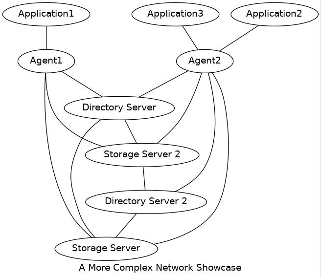

# Overview

## Network
Kache have simple network design.

The "Storage Server" and "Directory Server" even could put on same machine, then all back to the general C/S model.

In real life, we don't want applications do everything and know everything. A simple solution is a local provider to proxy requests from applications. It's named "Agent", it can be any shape: a system service, user deamon or even library bulit into software.

Acutally, "storage server" is not server as the view of "directory server" in kache. Also, storage server is not forced to work only with any directory server. The clients could work with many directory server and storage server.

Here we got a more complex picture of the network.

